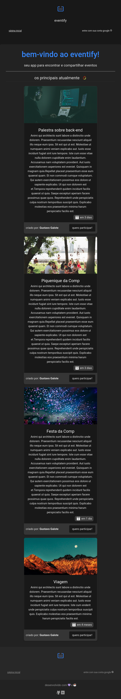

# eventify-compjr

Esse projeto é um monorepo para uma [empresa júnior](https://juniorenterprises.eu/what-is-a-junior-enterprise/), a [Comp Junior](https://www.compjunior.com.br/)!, da [UFLA (Universidade Federal de Lavras)](https://ufla.br/).
Desenvolvi durante meu processo de trainee, espero ser aprovado :P



## como executar

- primeiro, roda um `yarn` pra instalar tudo.

### front

- entre no diretório `packages/web` 
- crie um arquivo `.env` baseado no `.env.example`.
- volte para a raiz do projeto e rode `yarn dev:web`


### back

- entre no diretório `packages/api`
- crie um arquivo `.env` baseado no `.env.example`.
  - aqui será preciso utilizar MongoDB, você tem algumas opções:
    - Crie um no [MongoDB Atlas](https://www.mongodb.com/pt-br/atlas) e adapte a url
    - Utilize o `docker-compose` já criado e, se quiser, altere alguns dos dados [neste arquivo](./packages/api/docker-compose.yml)
    ```bash
      yarn db:up
    ```
- volte para a raiz do projeto e rode `yarn dev:api`